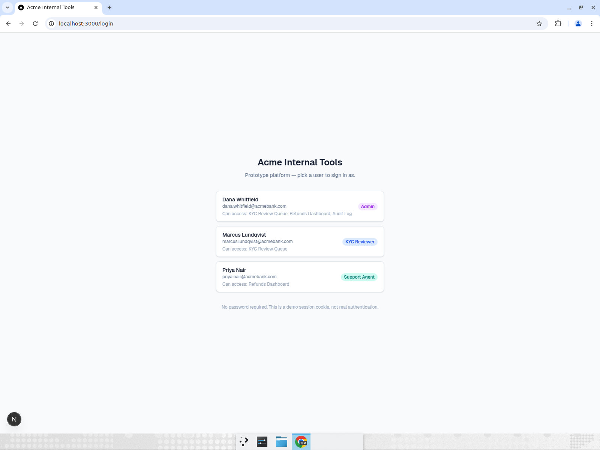
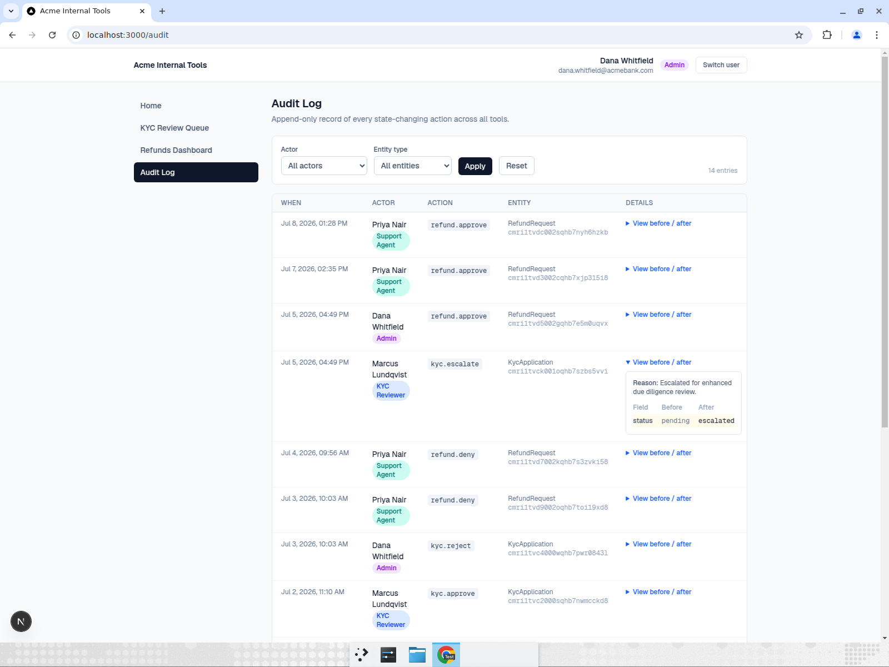
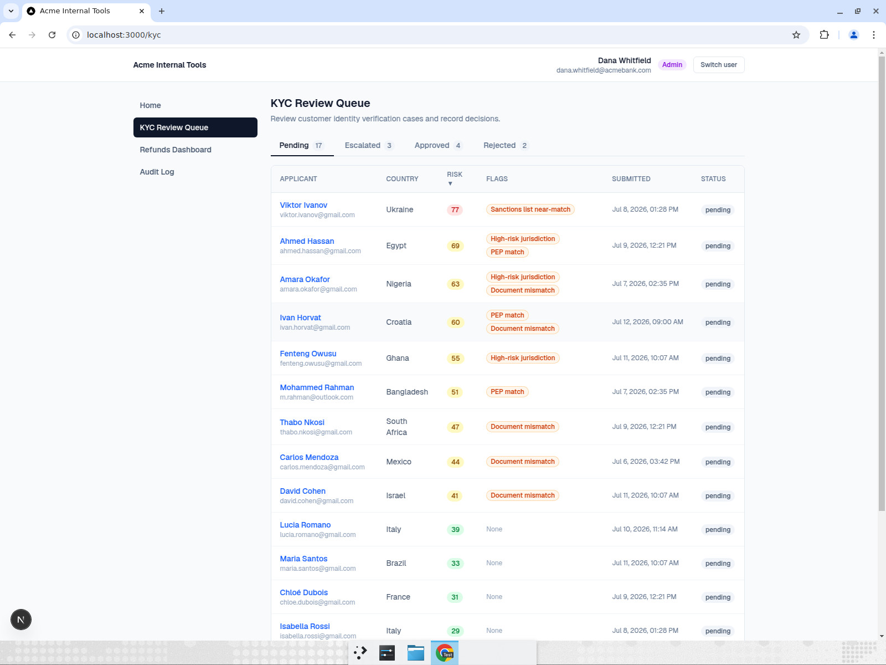
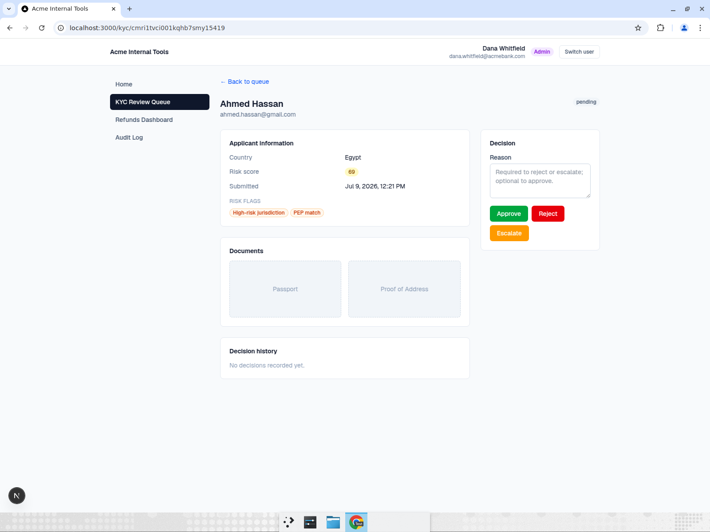
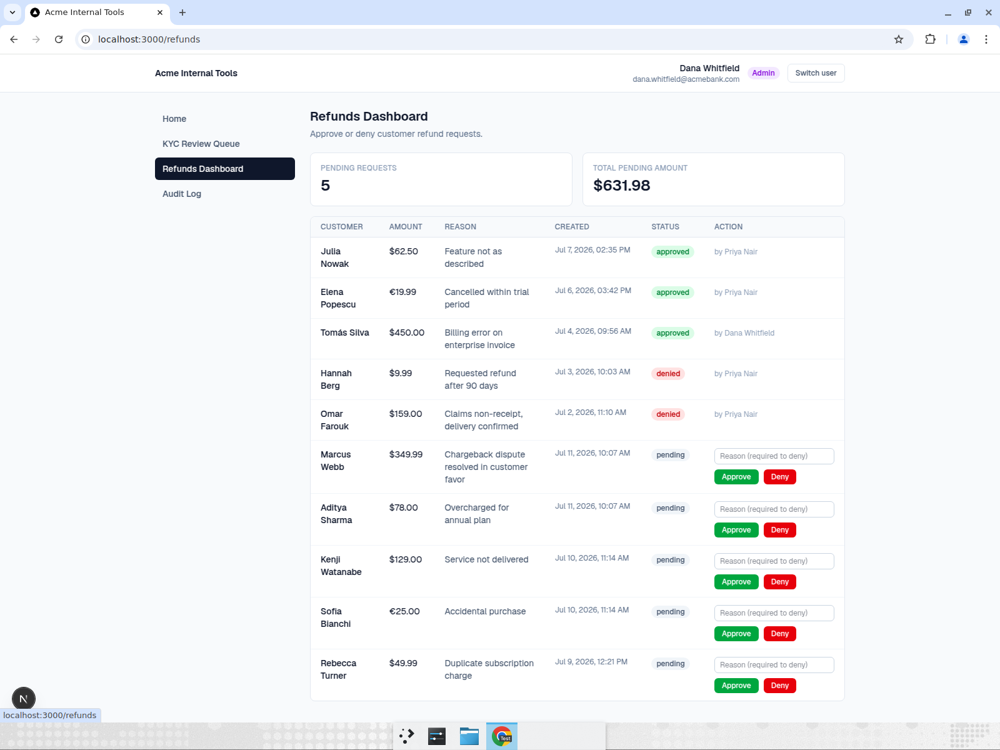

# Acme Internal Tools — Retool-alternative prototype

A 2-hour proof of concept for a Series C fintech evaluating whether to replace Retool
with an in-house internal-tools platform. It demonstrates two things: (a) how quickly
core internal-tool functionality can be built, and (b) that a **shared governance layer**
— auth, roles, and audit logging — can be reused across multiple internal apps. This is a
demo, not a production system: it favors a working, demoable happy path over completeness.

The key idea is **one platform, two tools**. A shared app shell provides layout, nav,
session handling, and role checks. Individual tools (a KYC review queue and a refunds
dashboard) plug into that shell. Every state-changing action in every tool flows through a
single shared `auditedAction()` helper that writes an append-only audit trail — the piece
a fintech client cares about most.

## Stack

- **Next.js (App Router) + TypeScript**
- **SQLite via Prisma** (zero-setup local run)
- **Tailwind CSS**
- **No real authentication.** A "login as..." user picker sets a session cookie.

## How to run

```bash
npm install      # installs deps and generates the Prisma client
npm run seed     # creates prisma/dev.db and loads realistic seed data
npm run dev      # starts the app at http://localhost:3000
```

Then open http://localhost:3000 and pick one of the three seeded users.

## Seeded users & what each can see

Access is enforced **on the server** (in the shell layout and every page/action), not just
hidden in the nav.

| User | Role | Can access |
| --- | --- | --- |
| Dana Whitfield | `admin` | KYC Review Queue, Refunds Dashboard, Audit Log |
| Marcus Lundqvist | `kyc_reviewer` | KYC Review Queue only |
| Priya Nair | `support_agent` | Refunds Dashboard only |

The database is also seeded with ~26 KYC applications (varied statuses and risk flags),
~10 refund requests, and backfilled historical audit entries so the demo looks real.

## The governance layer (the centerpiece)

Every mutation in any tool goes through one helper, which performs the change and writes an
append-only `AuditLog` row in a single transaction:

```ts
// lib/audit.ts
await auditedAction({
  actorId, action, entityType, entityId, reason,
  before,                                  // snapshot before the change
  mutate: (tx) => ({ result, after }),     // the actual write + snapshot after
});
// => prisma.$transaction: run mutate(tx), then tx.auditLog.create({ before, after, ... })
```

Each audit row records **who** (`actorId`), **what** (`action`), **which entity**
(`entityType` + `entityId`), **before/after** state (JSON), an optional **reason**, and a
**timestamp**. Role checks live in `lib/rbac.ts` and are enforced via
`requireAppAccess()` in `lib/session.ts`.

## Milestones

### Milestone 1 — Shell + governance layer

The platform shell and the reusable governance layer that both tools build on:

- **Login / session**: pick one of the three seeded users; a session cookie is set. The
  header shows the current user and role with a "Switch user" button.
- **Server-enforced RBAC**: admin sees everything; `kyc_reviewer` sees only KYC;
  `support_agent` sees only Refunds. Unauthorized routes redirect on the server.
- **`auditedAction()`** wired into the data layer.
- **Admin-only Audit Log viewer**: reverse-chronological, filterable by actor and entity
  type, with an expandable before/after diff (changed fields highlighted).





### Milestone 2 — KYC Review Queue

A fully built internal tool for reviewing customer identity verification cases:

- **Queue view**: status tabs (Pending / Escalated / Approved / Rejected) with counts,
  sortable by risk score, risk flags shown as badges, and color-coded risk (green <40,
  yellow 40–70, red >70).
- **Detail view**: applicant info, risk flags, document placeholders ("Passport", "Proof
  of Address"), and a decision panel.
- **Decision panel**: Approve / Reject / Escalate. Reject and Escalate **require a
  reason** (validated). Decisions update status + `decidedBy`/`decidedAt`/`reason` and
  write to the audit log via `auditedAction()`.
- **Per-application history**: that application's audit entries appear on its detail page.
- Only `admin` and `kyc_reviewer` can decide (server-enforced).





### Milestone 3 — Refunds Dashboard (deliberately thin)

A second tool, kept intentionally minimal to prove the platform makes new apps cheap. It
**reuses the shared shell, role checks, and `auditedAction()` with zero changes to the
platform layer**:

- Single page: summary stat cards (pending count, total pending amount) + a refund
  requests table.
- Inline Approve / Deny per pending request; **Deny requires a reason** (validated).
- Only `admin` and `support_agent` can decide (server-enforced).



## What's intentionally missing

This is a prototype scoped to a demo. Deliberately out of scope:

- **Real authentication** — no SSO, passwords, or identity provider. The session is just a
  cookie holding a user id; anyone can "log in" as anyone.
- **Granular / hierarchical permissions** — roles are coarse and hard-coded; no per-record
  ACLs, delegation, or approval chains.
- **SOC 2 / production controls** — no encryption at rest, log immutability guarantees,
  retention policies, PII handling, rate limiting, or alerting.
- **File / document handling** — KYC documents are grey placeholders; no upload, storage,
  or KYC-provider integration.
- **FX conversion** — the refunds "total pending amount" naively sums mixed currencies as
  USD; there is no real currency conversion.
- **Feature-flag admin panel, deployment config, tests, CI.**
- **Pagination, global search**, and anything beyond what each milestone specifies.

## Notable simplifications

- SQLite + `prisma db push` (no migration history) for zero-setup.
- `riskFlags` is stored as a JSON string column (SQLite has no native array type).
- `.env` (containing only the local SQLite path — no secrets) is committed so the app runs
  with no configuration.
